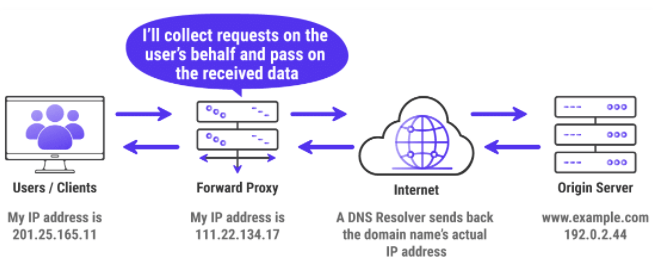
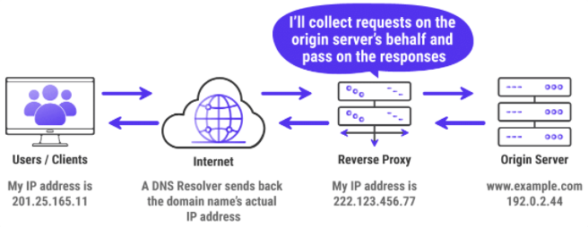
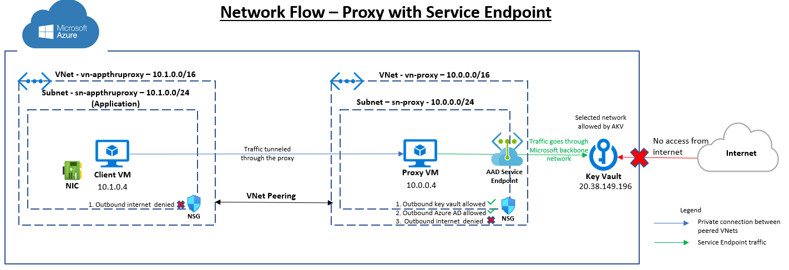

# Proxy - Reverse & Forward
## Forward proxy
If you want to anonymize your IP address from the websites you visit, then you can use a proxy server to send all your requests to it first. It’ll forward your requests to the DNS resolver and then download the website’s resources from its origin server. Afterward, it’ll pass on those resources to your device. This is called a forward proxy.



You’re completely hidden from the website as it thinks your request is originating from the forward proxy. Apart from enhancing user privacy, a forward proxy is mainly used to bypass geographical content restrictions. For instance, if you want to watch a video that’s blocked in your region, you can use a forward proxy with an IP address on which the video is available to view. They allow users to bypass content restrictions and monitoring, or enforce website content restrictions – so that you can’t log into certain web pages on company time.

Forward proxy was very useful and popular in the 1990s. Before NAT is integrated into network routers, forward proxy is the way for multiple computers in the same network to access the Internet. This type of forward proxy usually resides in the internal network.

Forward proxy can also act as a cache server in an internal network. If a resource is downloaded many times, then the proxy can cache the content on the server so next time when another computer downloads the same content, the proxy will send the content that is previously stored on the server to the computer.

There’re many different kinds of forward proxy such as web proxy, HTTP proxy, SOCKS proxy etc. Please keep in mind that using a forward proxy to browse the Internet usually slows down your overall Internet speed.

## Reverse Proxy
Reverse proxy is mainly used by server admins to achieve load balancing and high availability. A website may have several web servers behind the reverse proxy. The reverse proxy server takes requests from the Internet and forwards these requests to one of the back-end web servers.



Another use of a Reverse Proxy is to act as a secure portal, denying users on the internet direct access to back-end operating systems – i.e. the customer only ever talks to the proxy, the proxy talks to the back-end. Moderation based on destination URL and source IP can also be implemented with reverse proxy.

There are many reverse proxy software such as:
* Nginx can act as a web server and a reverse proxy at the same time.
* Apache can act as a web server and a reverse proxy at the same time.
* HAProxy is a well-known, feature-rich, and open-source reverse proxy software.

## Squid forward proxy
Squid is an open-source, full-featured web proxy cache server application which provides proxy and cache services for Hyper Text Transport Protocol (HTTP), File Transfer Protocol (FTP), and other popular network protocols. Squid can implement caching and proxying of Secure Sockets Layer (SSL) requests and caching of Domain Name Server (DNS) lookups, and perform transparent caching.

## Setup “Squid Proxy” Server on Ubuntu
Provision a Ubuntu server on Azure & name it vm-ubuntu-squidproxy in a VNet named as vn-proxy, inside a subnet sn-proxy. Configure the Ubuntu server as per the steps below.
```bash
# update your packages on ubuntu
sudo apt update
# install squid and start and enable it on system startup
sudo apt -y install squid
sudo systemctl start squid
sudo systemctl enable squid
# verify the status of the service
sudo systemctl status squid
```
### Configure Squid as forward proxy
Following are the some important squid file locations:
* Squid configuration file: /etc/squid/squid.conf
* Squid Access log: /var/log/squid/access.log
* Squid Cache log: /var/log/squid/cache.log

Default port for the HTTP proxy server on Squid is 3128. It can be changed to any port say 8080.

### Add Squid ACLs - allow only one IP address to access the internet through proxy server
```bash
# open the configuration file
sudo vim /etc/squid/squid.conf
# add ACL rule - Where XX.XX.XX.XX is the IP address of client machine
acl localnet src XX.XX.XX.XX
# example
acl localnet src 10.0.0.4       # IP address of the client
# restart Squid service to take the new changes into effect
sudo systemctl restart squid
```
### Block Specific Keyword with Squid
```bash
# create a file called “blockkeywords.lst” that will store the blacklisted keywords
sudo touch /etc/squid/blockkeywords.lst
# add the keywords that you wish to block access
facebook
instagram
gmail
# open Squid’s configuration file and add the following rule in the middle section of the file
acl blockkeywordlist url_regex "/etc/squid/blockkeywords.lst"
http_access deny blockkeywordlist
# save the file and restart squid
sudo systemctl restart squid
```

## Configure Client to Use Squid Proxy
Provision a windows VM vm-win10-appthruproxy in a VNet named as vn-appthruproxy, within a subnet sn-appthruproxy. Ensure that the VNets vn-appthruproxy & vn-proxy are peered.

Now to test that your proxy server is working or not, Change proxy settings, select “Manual proxy setup” and enter your proxy server vm-ubuntu-squidproxy private IP address and Port 1328 to be used for all connection. 

Once you fill all the required proxy details, you will be able to surf the Web using your Squid proxy server, you may do the same thing in any other browser or program you want.

To make sure that you are surfing the web using your proxy server, you may visit http://www.ipaddresslocation.org/, in the right top corner you must see the same IP address as your server IP address.

## Service Endpoint & tunneling through proxy server
If you tunnel the request through a proxy server, then the Service Endpoint has to be configured on the proxy server subnet. The proxy server would terminate the connection from the client and initiate a new connection on the client’s behalf and so the Azure Key Vault would see the connection coming from the proxy subnet. 



Configure the NSG on proxy server 
```bash
# Get the proxy server NSG name
vmName=vm-ubuntu-squidproxy
nicId=$(az vm list --query "[?name=='$vmName'].networkProfile[].networkInterfaces[].id" -o tsv)
nsgName=$(az network nsg list -o tsv --query "[?networkInterfaces[0].id=='$nicId'].name")
# Enable allow outbound to key vault
az network nsg rule create -g $rgName --nsg-name $nsgName -n AllowKeyVault \
    --priority 100 --source-address-prefixes VirtualNetwork --destination-address-prefixes 'AzureKeyVault' \
    --destination-port-ranges '443' --direction Outbound --access Allow --protocol Tcp --description "Allow outbound Key Vault"
# Enable allow outbound to Azure AD
az network nsg rule create -g $rgName --nsg-name $nsgName -n AllowAAD \
    --priority 110 --source-address-prefixes VirtualNetwork --destination-address-prefixes 'AzureActiveDirectory' \
    --destination-port-ranges '443' --direction Outbound --access Allow --protocol Tcp --description "Allow outbound Azure AD"
# Enable deny outbound to internet
az network nsg rule create -g $rgName --nsg-name $nsgName -n DenyInternet \
    --priority 120 --source-address-prefixes VirtualNetwork --destination-address-prefixes 'Internet' \
    --destination-port-ranges '*' --direction Outbound --access Deny --protocol '*' --description "Deny outbound internet"
```
Configure the NSG on the client VM to deny outbound internet connection. The client VM vm-win10-appthruproxy will not be able to make call to the internet any more. 
```bash
# Get the client VM NSG name
vmName=vm-appthruproxy
nicId=$(az vm list --query "[?name=='$vmName'].networkProfile[].networkInterfaces[].id" -o tsv)
nsgName=$(az network nsg list -o tsv --query "[?networkInterfaces[0].id=='$nicId'].name")
# Enable deny outbound to internet
az network nsg rule create -g $rgName --nsg-name $nsgName -n DenyInternet \
    --priority 1000 --source-address-prefixes VirtualNetwork --destination-address-prefixes 'Internet' \
    --destination-port-ranges '*' --direction Outbound --access Deny --protocol '*' --description "Deny outbound internet"
```

Provision a Key Vault & add a secret. 
```bash
# Create a Key Vault
kvName=kv-sep-proxy
az keyvault create -n $kvName -g $rgName -l $location --no-wait --verbose
# Add a secret "abhi" in the key vault
This step is accomplished manually since cli can not add a secret as it works on data plane
```
Enable Service Endpoint on the proxy server subnet sn-proxy and configure key vault to accept traffic only from proxy server subnet i.e. sn-proxy
```bash
# Turn on Key Vault Firewall
az keyvault update -n $kvName -g $rgName --default-action deny --verbose
# Enable service endpoint on the subnet sn-proxy
vnetName=vn-proxy
subnetName=sn-proxy
az network vnet subnet update -n $subnetName --vnet-name $vnetName --service-endpoints Microsoft.KeyVault -g $rgName --debug
# Add keyvault network rule to the network ACLs. In this case, it is the Proxy server VNet & Subnet
az keyvault network-rule add --name $kvName --subnet $subnetName --vnet-name $vnetName -g $rgName
```

Test the connectivity by creating a service principal & accessing the secret from the client VM using a curl command via proxy server.
```bash
# replace the ip address with the proxy server ip address
curl --location --request GET "https://kv1.vault.azure.net/secrets/abhi/xxxx?api-version=2016-10-01" --header "Authorization: Bearer xxxx" --proxy 10.0.0.5:3128 -v

# the logs will contain the following information where the addr will be of the proxy server
< x-ms-keyvault-network-info: conn_type=Subnet;subnet=xxxxx;addr=10.0.0.5;act_addr_fam=InterNetworkV6
```

View the logs in the Squid proxy server
```bash
# login to the proxy server & run below command
sudo tail -f /var/log/squid/access.log
# it will show logs as shown below
1623194041.721    503 10.1.0.4 TCP_TUNNEL/200 6559 CONNECT kv-sep-proxy.vault.azure.net:443 - HIER_DIRECT/20.38.149.197 -
```

## References
[Configure squid proxy on Ubuntu](https://www.tecmint.com/install-squid-in-ubuntu/)


